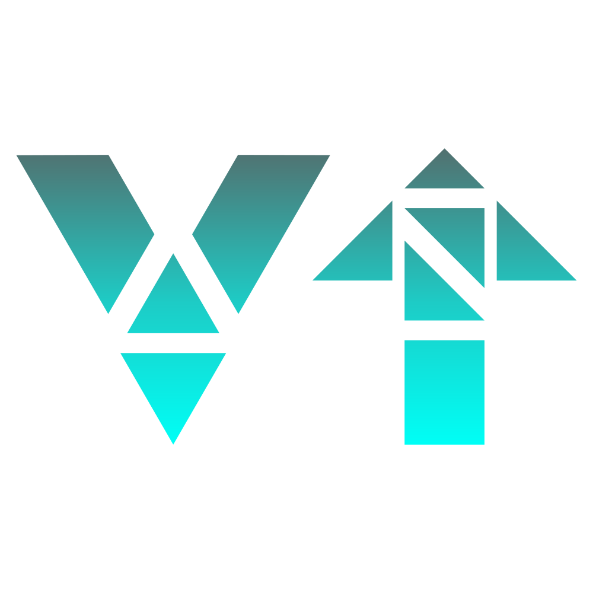

[![Contributors][contributors-shield]][contributors-url]
[![Forks][forks-shield]][forks-url]
[![Stargazers][stars-shield]][stars-url]
[![Issues][issues-shield]][issues-url]
[![MIT License][license-shield]][license-url]

<!-- PROJECT LOGO -->
 

  

<h3 align="center">VRC-Mod-Updater</h3>

  

    An awesome Java Application to update your VRChat Mods!
     
    <a href="https://github.com/GhostJumper/VRC-Mod-Updater"><strong>Explore the docs »</strong></a>
     
     
    <a href="https://github.com/GhostJumper/VRC-Mod-Updater">View Demo</a>
    ·
    <a href="https://github.com/GhostJumper/VRC-Mod-Updater/issues">Report Bug</a>
    ·
    <a href="https://github.com/GhostJumper/VRC-Mod-Updater/issues">Request Feature</a>
  

<!-- TABLE OF CONTENTS -->

  
Table of Contents

  <ol>
    <li>
      <a href="#about-the-project">About The Project</a>
      <ul>
        <li><a href="#built-with">Built With</a></li>
      </ul>
    </li>
    <li><a href="#usage">Usage</a></li>
    <li><a href="#roadmap">Roadmap</a></li>
    <li><a href="#contributing">Contributing</a></li>
    <li><a href="#license">License</a></li>
    <li><a href="#contact">Contact</a></li>
    <li><a href="#acknowledgements">Acknowledgements</a></li>
  </ol>

<!-- ABOUT THE PROJECT -->

## About The Project

So, I think I don't need to tell you that keeping all your mods up do date is a huge pain. Instead of searching for the
newest version of your mods, why don't you just let this little application handle it?

Here's why:

* Your time should be focused on doing something amazing. A project that solves a problem and helps others
* You shouldn't be doing the same tasks over and over like searching for all the download links.

Of course, no one application can keep up all of your mods up to date. Depending on all your Mods and their download
sources, it might not be possible to update all of them. I do my best to keep this program up to date as well as all
your mods.

### Built With

* [Maven](https://maven.apache.org/)

## Usage

1. Download the newest [release](https://github.com/GhostJumper/VRC-Mod-Updater/releases/latest)
2. Place it in your `Mods` folder
3. Shift + Right Click -> Open PowerShell window here / Any other shell
4. `java -jar vrc-mod-updater.jar`

<!-- ROADMAP -->

## Roadmap

See the [open issues](https://github.com/GhostJumper/VRC-Mod-Updater/issues) for a list of proposed features (and known
issues).

<!-- CONTRIBUTING -->

## Contributing

Contributions are what make the open source community such an amazing place to learn, inspire, and create. Any
contributions you make are **greatly appreciated**.

1. Fork the Project
2. Create your Feature Branch (`git checkout -b feature/AmazingFeature`)
3. Commit your Changes (`git commit -m 'Add some AmazingFeature'`)
4. Push to the Branch (`git push origin feature/AmazingFeature`)
5. Open a Pull Request

<!-- LICENSE -->

## License

Distributed under the MIT License. See `LICENSE` for more information.

<!-- CONTACT -->

## Contact

Project Link: [https://github.com/GhostJumper/VRC-Mod-Updater](https://github.com/GhostJumper/VRC-Mod-Updater)

<!-- ACKNOWLEDGEMENTS -->

## Acknowledgements

* [ Best-README-Template Template](https://github.com/othneildrew/Best-README-Template)

<!-- MARKDOWN LINKS & IMAGES -->
<!-- https://www.markdownguide.org/basic-syntax/#reference-style-links -->

[contributors-shield]: https://img.shields.io/github/contributors/GhostJumper/VRC-Mod-Updater.svg?style=for-the-badge

[contributors-url]: https://github.com/GhostJumper/VRC-Mod-Updater/graphs/contributors

[forks-shield]: https://img.shields.io/github/forks/GhostJumper/VRC-Mod-Updater.svg?style=for-the-badge

[forks-url]: https://github.com/GhostJumper/VRC-Mod-Updater/network/members

[stars-shield]: https://img.shields.io/github/stars/GhostJumper/VRC-Mod-Updater.svg?style=for-the-badge

[stars-url]: https://github.com/GhostJumper/VRC-Mod-Updater/stargazers

[issues-shield]: https://img.shields.io/github/issues/GhostJumper/VRC-Mod-Updater.svg?style=for-the-badge

[issues-url]: https://github.com/GhostJumper/VRC-Mod-Updater/issues

[license-shield]: https://img.shields.io/github/license/GhostJumper/VRC-Mod-Updater.svg?style=for-the-badge

[license-url]: https://github.com/GhostJumper/VRC-Mod-Updater/blob/master/LICENSE.txt
